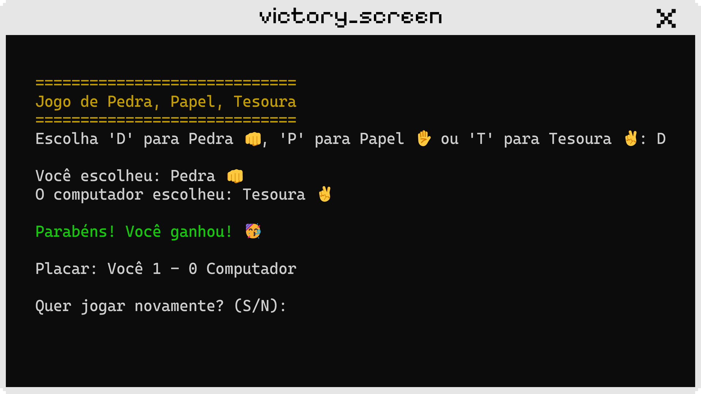

# MeuPrimeiroProjeto

Este projeto foi desenvolvido como parte de uma atividade do curso técnico em Informática para Internet do SENAI. O objetivo foi criar uma aplicação console em .NET do clássico jogo de **Pedra, Papel, Tesoura**.

## PedraPapelTesoura

### O que é?
O jogo de Pedra, Papel, Tesoura é um jogo clássico onde dois jogadores (ou um jogador contra o computador) escolhem uma das três opções: Pedra, Papel ou Tesoura. As regras são simples:
- Pedra vence Tesoura
- Tesoura vence Papel
- Papel vence Pedra

### Como funciona?
1. Ao iniciar o jogo, o computador escolhe aleatoriamente uma das três opções.
2. O jogador deve escolher sua opção digitando:
   - `D` para Pedra
   - `P` para Papel
   - `T` para Tesoura
3. O jogo determina o vencedor com base nas escolhas.
4. O placar é atualizado após cada rodada, mostrando a pontuação do jogador e do computador.
5. O jogador pode optar por jogar novamente ou encerrar o jogo.





### Como construir o jogo?
Para construir o jogo, siga os passos abaixo:

1. Clone o repositório:

   ```git clone https://github.com/duacarol/MeuPrimeiroProjeto.git```

2. Navegue até a pasta do projeto:

   ```cd MeuPrimeiroProjeto```

3. Abra o projeto no Visual Studio ou no seu editor de preferência.

4. Compile e execute o código:

   ```dotnet run```